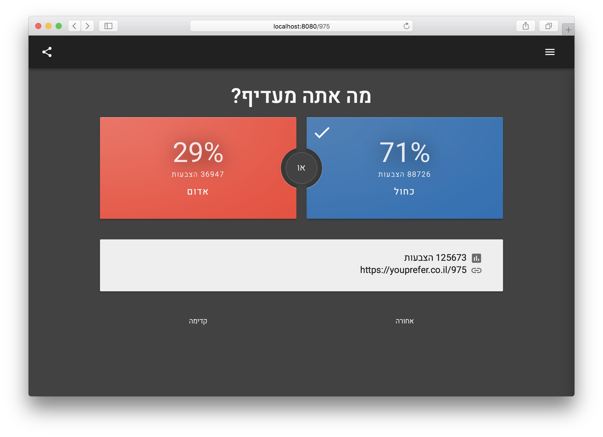
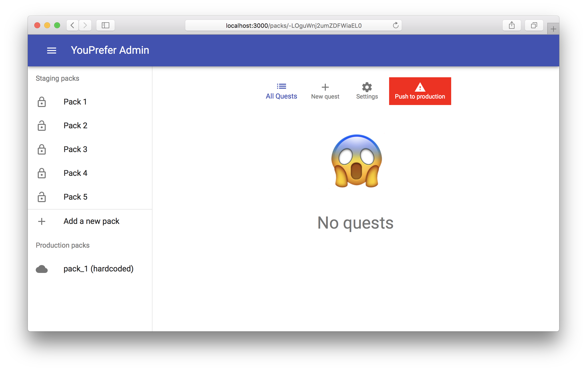
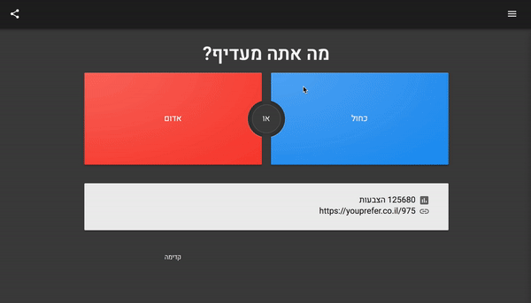

<div align="center">
  
  <h1>YouPrefer Web</h1>
  <p>Webapp version of YouPrefer</p>
  <small><a href="https://youprefer.co.il/" target="_blank">Live version</a></small>
</div>

[](https://github.com/yardnsm/youprefer-web/actions)
[](https://github.com/yardnsm/youprefer-web/actions)

## Introduction

YouPrefer is a small game that I made when learning Android Development. It's a "would you rather"
game in Hebrew: in each step you need to choose one of 2 options; both of them has a part of moral
dilemma or such. After the selection, the you'll able to see how many users chose the different
possibilities.

This is the web version of that game, which I refined a bit before making available as open-source.



## Technologies used

- [`React`](https://reactjs.org/) as the view layer of the app;
- [`Redux`](https://redux.js.org/) for managing the app's state;
- [`styled-components`](https://www.styled-components.com/) as a CSS-in-JS solution;
- [`Firebase`](https://firebase.google.com/) as the main backend of the app;
- [`Webpack`](https://webpack.js.org/) as the main build tool for this app;
- [`Jest`](https://jestjs.io/) as the test runner;

... and some [more stuff](./package.json).

## How do I manage the app

I made another webapp called `youprefer-admin`, for managing the questions database. It uses the
same technologies mentioned above, and `firebase-admin` in order to gain admin access to the
database. Currently this app is not open-sourced, but maybe in the future?



## Nice stuff

#### Generating the HTML file

This project is using [`html-webpack-plugin`](https://github.com/jantimon/html-webpack-plugin) to
generate a HTML file in build time. It also uses partials to separate some parts of the final HTML
into chunks (check the [templates](./templates) folder).


#### Splash screen


The splash screen is generated in the app's HTML file. It disappears when the app has been fully
loaded.

#### Material design ripple effect



This is my attempt at creating the material design ripple effect. It's implemented as an HOC
(`withRipple`), and reponds very smoothly to mouse and touch events. [Check it
out!](src/hoc/withRipple.jsx)

## Running locally

### Setting up the project

Clone the repository and run the following:

```console
$ npm install
```

Then, you'll need to copy the file
[`./src/config/app-config.sample.js`](./src/config/app-config.sample.js) to
`./src/config/app-config.js` and fill the appropriate details.

You can leave the config for Adsense and Analytics as-is if you don't mind. Follow the instructions
in the [Firebase docs](https://firebase.google.com/docs/web/setup) to retreive the details.

### Setting up Firebase

You'll need to set up Firebase's Realtime Database properly in order to make this app work. You can
find a sample database to import [here](.github/youprefer-database-export.json).

### Running the dev server

Running the following will start the dev server and will automatically open the webapp in your
default browser:

```console
$ npm start
```

### Running under https

Webpack Dev Server can ganarates https certs for us to use. However, we need to add them to our
system's keychain. On macOS, run the following:

```console
# Start the dev server in https mode, then abort it
$ npm run start:https

# This requires openssl to be installed
$ openssl x509 -outform der \
  -in ./node_modules/.cache/webpack-dev-server/server.pem \
  -out ./ssl/server.crt

# Then add it to the system's keychain
$ sudo security add-trusted-cert -d -r trustRoot \
  -k /Library/Keychains/System.keychain \
  ./ssl/server.crt
```

After that, run the dev server in https mode:

```console
$ npm run start:https
```

## Deploying

### Deploying to firebase

Make sure to have the Firebase CLI installed globally:

```console
$ npm install -g firebase-tools
```

Then, login to the CLI and configure it to deploy to your instance (you'll only need to do this
once):

```console
$ firebase login

# Use the alias `default` when you're asked to choose one
$ firebase use --add
```

From now on, when you're ready to deploy, run the following:

```console
$ npm run build
$ firebase deploy
```

### Deploying to dokku

Configure dokku on your remote server. When you're ready to push, run the following:

```console
$ npm run build
$ git subtree push --prefix=dist dokku master
```

---

## License

MIT © [Yarden Sod-Moriah](http://yardnsm.net/)
